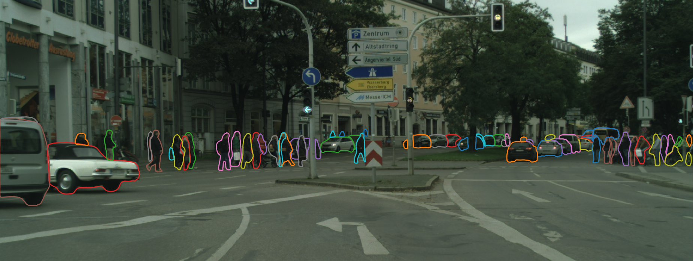
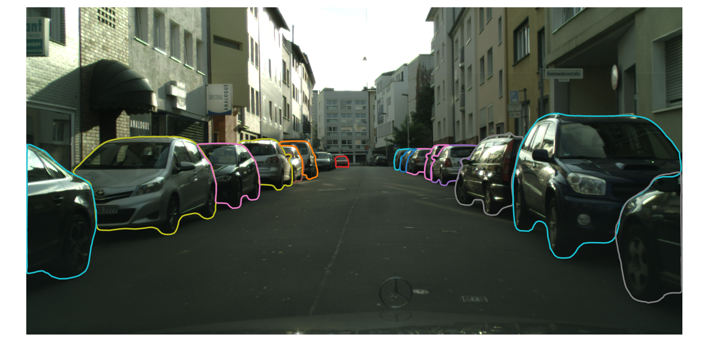
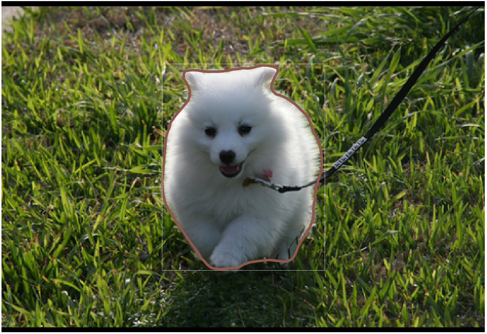
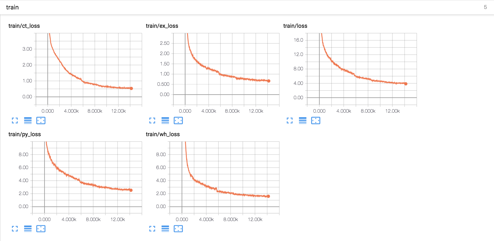

# Deep Snake for Real-Time Instance Segmentation



> [Deep Snake for Real-Time Instance Segmentation](https://arxiv.org/pdf/2001.01629.pdf)  
> Sida Peng, Wen Jiang, Huaijin Pi, Xiuli Li, Hujun Bao, Xiaowei Zhou  
> CVPR 2020 oral

Any questions or discussions are welcomed!

## Installation

Please see [INSTALL.md](INSTALL.md).

## Testing

### Testing on Cityscapes

1. Download the pretrained model [here](https://zjueducn-my.sharepoint.com/:u:/g/personal/pengsida_zju_edu_cn/EX6rAwkK7jBEp7LxKbYIjAkB0QCFjBL4Ov6_aaK1zZFfrA?e=fRWG2x) and put it to `$ROOT/data/model/rcnn_snake/long_rcnn/197.pth`.
2. Test:
    ```
    # use coco evaluator
    python run.py --type evaluate --cfg_file configs/city_rcnn_snake.yaml
    # use the cityscapes official evaluator
    python run.py --type evaluate --cfg_file configs/city_rcnn_snake.yaml test.dataset CityscapesVal
    ```
3. Speed:
    ```
    python run.py --type network --cfg_file configs/city_rcnn_snake.yaml
    ```

### Testing on Kitti

1. Download the pretrained model [here](https://zjueducn-my.sharepoint.com/:u:/g/personal/pengsida_zju_edu_cn/ERrNrpFPg71HmaegOIqypFkBzqeYn84RF5Sq9dUZM7nsbg?e=bQZ8bp) and put it to `$ROOT/data/model/snake/kins/149.pth`.
2. Test:
    ```
    python run.py --type evaluate --cfg_file configs/kins_snake.yaml test.dataset KinsVal
    ```
3. Speed:
    ```
    python run.py --type network --cfg_file configs/kins_snake.yaml test.dataset KinsVal
    ```

### Testing on Sbd

1. Download the pretrained model [here](https://zjueducn-my.sharepoint.com/:u:/g/personal/pengsida_zju_edu_cn/EVIoAulD8ORAli3qjdPBMOoBbRTHaxhPHn_a76EznL_W-g?e=EzQQS1) and put it to `$ROOT/data/model/snake/sbd/149.pth`.
2. Test:
    ```
    python run.py --type evaluate --cfg_file configs/sbd_snake.yaml test.dataset SbdVal
    ```
3. Speed:
    ```
    python run.py --type network --cfg_file configs/sbd_snake.yaml test.dataset SbdVal
    ```

## Visualization

### Visualization on Cityscapes

1. Download the pretrained model [here](https://zjueducn-my.sharepoint.com/:u:/g/personal/pengsida_zju_edu_cn/EX6rAwkK7jBEp7LxKbYIjAkB0QCFjBL4Ov6_aaK1zZFfrA?e=fRWG2x) and put it to `$ROOT/data/model/rcnn_snake/long_rcnn/197.pth`.
2. Visualize:
    ```
    # Visualize Cityscapes test set
    python run.py --type visualize --cfg_file configs/city_rcnn_snake.yaml test.dataset CityscapesTest ct_score 0.3
    # Visualize Cityscapes val set
    python run.py --type visualize --cfg_file configs/city_rcnn_snake.yaml test.dataset CityscapesVal ct_score 0.3
    ```

If setup correctly, the output will look like



### Visualization on Kitti

1. Download the pretrained model [here](https://zjueducn-my.sharepoint.com/:u:/g/personal/pengsida_zju_edu_cn/ERrNrpFPg71HmaegOIqypFkBzqeYn84RF5Sq9dUZM7nsbg?e=bQZ8bp) and put it to `$ROOT/data/model/snake/kins/149.pth`.
2. Visualize:
    ```
    python run.py --type visualize --cfg_file configs/kins_snake.yaml test.dataset KinsVal ct_score 0.3
    ```

### Visualization on Sbd

1. Download the pretrained model [here](https://zjueducn-my.sharepoint.com/:u:/g/personal/pengsida_zju_edu_cn/EVIoAulD8ORAli3qjdPBMOoBbRTHaxhPHn_a76EznL_W-g?e=EzQQS1) and put it to `$ROOT/data/model/snake/sbd/149.pth`.
2. Visualize:
    ```
    python run.py --type visualize --cfg_file configs/sbd_snake.yaml test.dataset SbdVal ct_score 0.3
    ```

### Demo

We support demo for image and image folder using `python run.py --type demo --cfg_file /path/to/yaml_file demo_path /path/to/image ct_score 0.3`.

For example:

```
python run.py --type demo --cfg_file configs/sbd_snake.yaml demo_path demo_images ct_score 0.3
# or
python run.py --type demo --cfg_file configs/sbd_snake.yaml demo_path demo_images/2009_000871.jpg ct_score 0.3
```

If setup correctly, the output will look like



## Training

The training parameters can be found in [project_structure.md](project_structure.md).

### Training on Cityscapes

Two-stage training:

1. Train the detector:
    ```
    python train_net.py --cfg_file configs/city_ct_rcnn.yaml model rcnn_det
    ```
2. Train the detector and snake together:
    ```
    python train_net.py --cfg_file configs/city_rcnn_snake.yaml model rcnn_snake det_model rcnn_det
    ```

### Training on Kins

```
python train_net.py --cfg_file configs/kins_snake.yaml model kins_snake
```

### Training on Sbd

```
python train_net.py --cfg_file configs/sbd_snake.yaml model sbd_snake
```

### Tensorboard

We provide tensorboard for seeing the training status:

```
# for the rcnn_snake task
tensorboard --logdir data/record/rcnn_snake
# for the snake task
tensorboard --logdir data/record/snake
```

If setup correctly, the output will look like



## Citation

If you find this code useful for your research, please use the following BibTeX entry.

```
@inproceedings{peng2020deep,
  title={Deep Snake for Real-Time Instance Segmentation},
  author={Peng, Sida and Jiang, Wen and Pi, Huaijin and Li, Xiuli and Bao, Hujun and Zhou, Xiaowei},
  booktitle={CVPR},
  year={2020}
}
```
